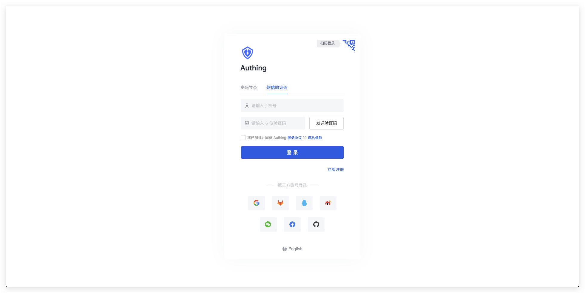

  
  
  
  
  

 

[English](./README.md) | 简体中文 

[Authing](https://authing.cn) 是一个企业级身份认证提供商，其集成了 OAuth、LDAP、OIDC 等多种身份认证和授权解决方案。此仓库包含了 Authing 提供的一些 UI 组件。

## 🌍 生态系统

| 包名                             | 版本                                                                                                                                              | 使用文档                                                                                                             |
| -------------------------------- | ------------------------------------------------------------------------------------------------------------------------------------------------- | -------------------------------------------------------------------------------------------------------------------- |
| @authing/react-ui-components     |          | [Authing React UI Components](https://docs.authing.cn/v2/reference/ui-components/react.html)                         |
| @authing/vue-ui-components       |              | [Authing Vue UI Components](https://docs.authing.cn/v2/reference/ui-components/vue.html)                             |
| @authing/native-js-ui-components |  | [Authing Native JavaScript UI Components](https://docs.authing.cn/v2/reference/ui-components/native-javascript.html) |

## ✨ 登录组件（Guard）

Authing 登录组件（Guard）是一种可嵌入的登录表单，可根据你的需求进行配置，建议用于单页面应用程序。它使你可以轻松添加各种社会化登录方式，以便你的用户可以无缝登录，并且在不同平台拥有一致的登录体验。Guard 为开发者屏蔽了很多底层认证的实现细节，同时也包括繁琐的 UI 开发。

Guard 可以集成到你的 React、Vue.js 以及原生 JavaScript 项目中，你可以借助此组件快速实现登录认证流程。

## 🌈 功能列表

#### 丰富的登录注册方式

内置丰富的登录注册方式供开发者选择：

- 账号密码登录（包括手机号 + 密码、邮箱 + 密码、用户名 + 密码）
- 手机验证码登录
- APP 扫码登录（[需先接入 APP 扫码登录](https://docs.authing.cn/v2/guides/authentication/qrcode/use-self-build-app/)）
- 小程序扫码登录（[需先在后台配置](https://docs.authing.cn/v2/guides/authentication/qrcode/use-wechat-miniprogram/)）
- 社会化登录，如 Github 登录（[需先在后台配置](https://docs.authing.cn/v2/guides/connections/social.html)）
- 企业身份源登录（[需要配置企业身份源](https://docs.authing.cn/v2/guides/connections/enterprise.html)）

#### 内置忘记密码流程

Guard 内置了忘记密码的交互 UI，你无需编写任何额外代码。

#### 内置多因素认证（MFA）能力

Guard 内置了多因素认证（MFA）功能，当你的[应用开启了多因素认证](https://docs.authing.cn/v2/guides/app/mfa.html)之后，用户可以使用该组件完成多因素认证。你无需编写任何额外代码。

#### 响应式布局

响应式布局，完美兼容移动端和 PC 端，同时你可以通过自定义 CSS 轻易地自定义登录框样式。

#### 兼容前端所有主流框架

- [原生 JavaScript 调用](https://docs.authing.cn/v2/reference/ui-components/native-javascript.html)
- [Vue 组件](https://docs.authing.cn/v2/reference/ui-components/vue.html)
- [React 组件](https://docs.authing.cn/v2/reference/ui-components/react.html)

## 🌴 在线体验

点击查看 [sample-sso.authing.cn](https://sample-sso.authing.cn/login?app_id=5d70d0e991fdd597019df70d&protocol=oidc&finish_login_url=%2Finteraction%2Foidc%2Fd7223e6b-b796-4068-a3f2-298d527993c2%2Flogin&login_page_context=)

## 🌳 获取帮助

加入论坛: [#authing-chat](https://forum.authing.cn/)

详细使用文档请查看 [Guard for Web](https://docs.authing.cn/v2/reference/ui-components/)

## 🍻 开源共建

- Fork 此仓库
- 创建自己的 git 分支 (git checkout -b my-new-feature)
- 提交你的修改 (git commit -am 'Add some feature')
- 将修改内容推送到远程分支 (git push origin my-new-feature)
- 创建一个 Pull Request

## 📝 开源许可

[MIT](https://opensource.org/licenses/MIT)

Copyright (c) 2019-present Authing
