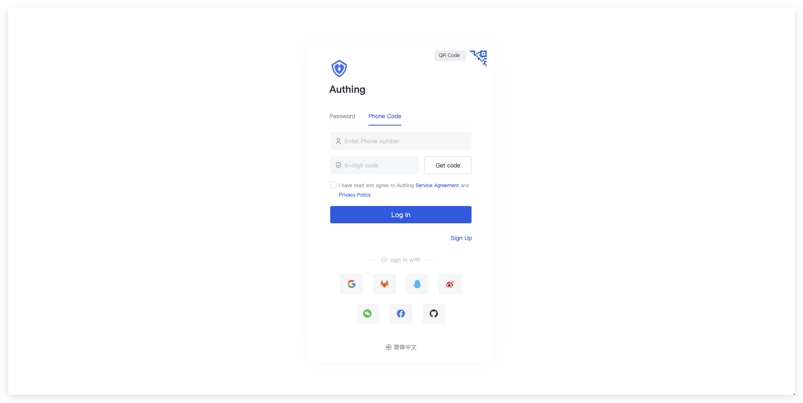

  
  
  
  
  

 

English | [简体中文](./README-zh_CN.md) 

[Authing](https://authing.cn) is an enterprise-class identity provider that integrates with OAuth, LDAP, OIDC, and other authentication and authorization solutions. This repository contains some of the UI components provided by Authing.

## 🌍 Ecosystem

| package                          | version                                                                                                                                           | Using the documentation                                                                                              |
| -------------------------------- | ------------------------------------------------------------------------------------------------------------------------------------------------- | -------------------------------------------------------------------------------------------------------------------- |
| @authing/react-ui-components     |          | [Authing React UI Components](https://docs.authing.cn/v2/reference/ui-components/react.html)                         |
| @authing/vue-ui-components       |              | [Authing Vue UI Components](https://docs.authing.cn/v2/reference/ui-components/vue.html)                             |
| @authing/ng-ui-components        |                | [Authing Angular UI Components](https://docs.authing.cn/v2/reference/ui-components/angular.html)                     |
| @authing/native-js-ui-components |  | [Authing Native JavaScript UI Components](https://docs.authing.cn/v2/reference/ui-components/native-javascript.html) |

## ✨ Login Component (Guard)

Authing Login Component (Guard) is an embeddable login form that can be configured according to your needs and is recommended for single page applications. It allows you to easily add various social login methods so that your users can log in seamlessly and have a consistent login experience across platforms. guard shields developers from many of the underlying authentication implementation details, as well as tedious UI development.

Guard can be integrated into your React, Vue.js, Angular, and native JavaScript projects, and you can quickly implement a login authentication process with this component.

## 🌈 Feature List

#### Rich login and registration methods

Rich login and registration options are built in for developers to choose from:

- Account password login (including mobile number + password, email + password, username + password)
- Mobile verification code login
- APP Scan code to login（[You need to access the APP first and scan the code to log in](https://docs.authing.cn/v2/en/guides/authentication/qrcode/use-self-build-app/)）
- Applet Sweep Login（[You need to configure it in the backend first](https://docs.authing.cn/v2/en/guides/connections/social/wechat-miniprogram-qrconnect/)）
- Social Identity Source Login, such as Github logins（[You need to configure it in the backend first](https://docs.authing.cn/v2/en/guides/connections/social.html)）
- Enterprise Identity Source Login（[Requires configuration of enterprise identity source](https://docs.authing.cn/v2/en/guides/connections/enterprise.html)）

#### Built-in forgotten password process

Guard has a built-in interactive UI for forgetting passwords, so you don't need to write any additional code.

#### Built-in Multi-Factor Authentication (MFA) capability

Guard has a built-in Multi-Factor Authentication (MFA) feature that allows users to use this component to complete multi-factor authentication when your application has [multi-factor authentication enabled](https://docs.authing.cn/v2/en/guides/app/mfa.html). You don't need to write any additional code.

#### Responsive layout

Responsive layout, perfectly compatible with mobile and PC, while you can easily customize the login box style with custom CSS.

#### Compatible with all major front-end frameworks

- [Native JavaScript](https://docs.authing.cn/v2/en/reference/ui-components/native-javascript.html)
- [Vue Components](https://docs.authing.cn/v2/en/reference/ui-components/vue.html)
- [React Components](https://docs.authing.cn/v2/en/reference/ui-components/react.html)
- [Angular Components](https://docs.authing.cn/v2/en/reference/ui-components/angular.html)

## 🌴 Online Experience

Click to view [sample-sso.authing.cn](https://sample-sso.authing.cn/login?app_id=5d70d0e991fdd597019df70d&protocol=oidc&finish_login_url=%2Finteraction%2Foidc%2Fd7223e6b-b796-4068-a3f2-298d527993c2%2Flogin&login_page_context=)

## 🌳 Get Help

Join us on forum: [#authing-chat](https://forum.authing.cn/)

For detailed usage documentation, please see [Guard for Web](https://docs.authing.cn/v2/en/reference/ui-components/)

## 🍻 Open Source Co-Building

- Fork it
- Create your feature branch (git checkout -b my-new-feature)
- Commit your changes (git commit -am 'Add some feature')
- Push to the branch (git push origin my-new-feature)
- Create new Pull Request

## 📝 LICENSE

[MIT](https://opensource.org/licenses/MIT)

Copyright (c) 2019 Authing
