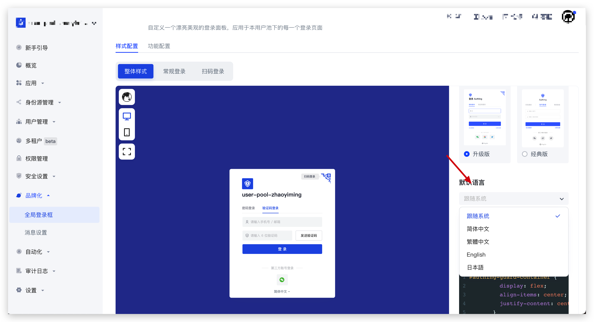

# Guard 控制台配置项与本地配置

如果你没有进行额外配置，Authing Guard 将默认使用云端的 Authing 控制台配置选项。一旦进行额外配置，则将覆盖控制台中的配置。以 Guard 默认语言为例。

默认情况下，Guard 会读取品牌化配置中的『默认语言』作为默认展示语言：

你也可以通过 `changeLang` 方法修改需要展示的语言，参考 [切换语言](./change-language.md)。
