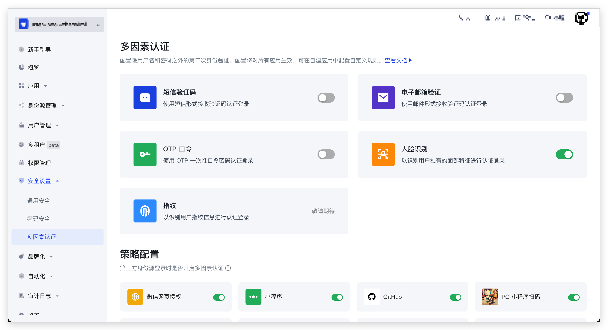

# MFA 多因素认证

多因素认证（Multi Factor Authentication，简称 MFA）是一种非常简单的安全实践方法，它能够在用户名称和密码之外额外增加一层保护。启用多因素认证后，用户进行操作时，除了需要提供用户名和密码外（第一次身份验证），还需要进行第二次身份验证。多因素认证结合起来将为你的帐号和资源提供更高的安全保护。

进入 Authing 控制台，左侧菜单选择 **安全设置 -> 多因素认证**，即可在右侧开启对应的多因素认证。



::: hint-info
使用『人脸识别』功能，需引入 `face-api` 插件。
:::


初始化 Guard 时传入参数 `facePlugin` 即可。

:::: tabs :options="{ useUrlFragment: false }"

::: tab React

``` shell
npm install --save face-api.js
```

```tsx
// App.tsx

// React 16/17
// 代码示例：https://github.com/Authing/Guard/tree/dev-v6/examples/guard-react/normal/src/pages/Embed.tsx
import { GuardProvider } from '@authing/guard-react';
import '@authing/guard-react/dist/esm/guard.min.css';

// React 18
// 代码示例：https://github.com/Authing/Guard/tree/dev-v6/examples/guard-react18/normal/src/pages/Embed.tsx
// import { GuardProvider } from '@authing/guard-react18';
// import '@authing/guard-react18/dist/esm/guard.min.css';

import React from 'react';
import * as facePlugin from 'face-api.js';
// 你的业务根组件
import RouterComponent from './router';

function App() {
  return (
    <GuardProvider
      appId="AUTHING_APP_ID"
      facePlugin={facePlugin}
    >
      <RouterComponent></RouterComponent>
    </GuardProvider>
  )
}
```
:::

::: tab Vue2

``` shell
npm install --save face-api.js
```

```javascript
// 代码示例：https://github.com/Authing/Guard/tree/dev-v6/examples/guard-vue2/normal/src/views/Embed.vue
// main.js
import * as facePlugin from 'face-api.js'

import Vue from 'vue'
import { GuardPlugin } from '@authing/guard-vue2'

import '@authing/guard-vue2/dist/esm/guard.min.css'

Vue.use(GuardPlugin, {
  appId: 'AUTHING_APP_ID',
  facePlugin: facePlugin
})
```

:::

::: tab Vue3
``` shell
npm install --save face-api.js
```

``` typescript
// 代码示例：https://github.com/Authing/Guard/tree/dev-v6/examples/guard-vue3/normal/src/views/Embed.vue
// main.ts
import { createApp } from 'vue'

import { createGuard } from '@authing/guard-vue3'

import '@authing/guard-vue3/dist/esm/guard.min.css'

import * as facePlugin from 'face-api.js'

import App from './App.vue'

const app = createApp(App)

app.use(
  createGuard({
    appId: 'AUTHING_APP_ID',
    facePlugin: facePlugin
  })
)
```
:::

::: tab Angular
``` shell
npm install --save face-api.js
```

``` typescript
// 代码示例：https://github.com/Authing/Guard/tree/dev-v6/examples/guard-angular/normal/src/app/pages/embed/embed.component.ts
// app.module.ts
import { NgModule } from '@angular/core'
import { BrowserModule } from '@angular/platform-browser'

import { AppRoutingModule } from './app-routing.module'
import { AppComponent } from './app.component'

import { GuardModule } from '@authing/guard-angular'

import * as facePlugin from 'face-api.js'

@NgModule({
  declarations: [
    AppComponent
  ],
  imports: [
    BrowserModule,
    AppRoutingModule,
    GuardModule.forRoot({
      appId: 'AUTHING_APP_ID',
      facePlugin: facePlugin
    })
  ],
  providers: [],
  bootstrap: [AppComponent]
})

export class AppModule { }
```
:::

::: tab CDN
```html
<!DOCTYPE html>
<html lang="en">
<head>
  <meta charset="UTF-8">
  <meta http-equiv="X-UA-Compatible" content="IE=edge">
  <meta name="viewport" content="width=device-width, initial-scale=1.0">
  <title>Authing Guard Demo</title>
  <script src="https://cdn.authing.co/packages/face-api/face-api.min.js"></script>
  <script type="text/javascript" src="https://cdn.authing.co/packages/guard/latest/guard.min.js"></script>
  <link rel="stylesheet" href="https://cdn.authing.co/packages/guard/latest/guard.min.css" />
</head>
<body>
  <div id="authing-guard-container"></div>

  <script>
    const guard = new GuardFactory.Guard({
      appId: 'AUTHING_APP_ID',
      facePlugin: faceapi
    })
  </script>
</body>
</html>
```
:::

::::

::: hint-info
你可能感兴趣：<a href="https://docs.authing.cn/v2/guides/authentication/mfa/policy-based-mfa-configuration.html" target="_blank">MFA 策略配置</a>
:::