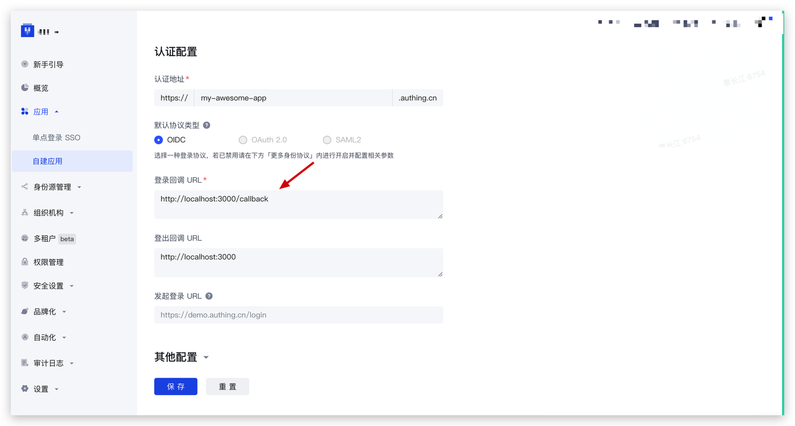
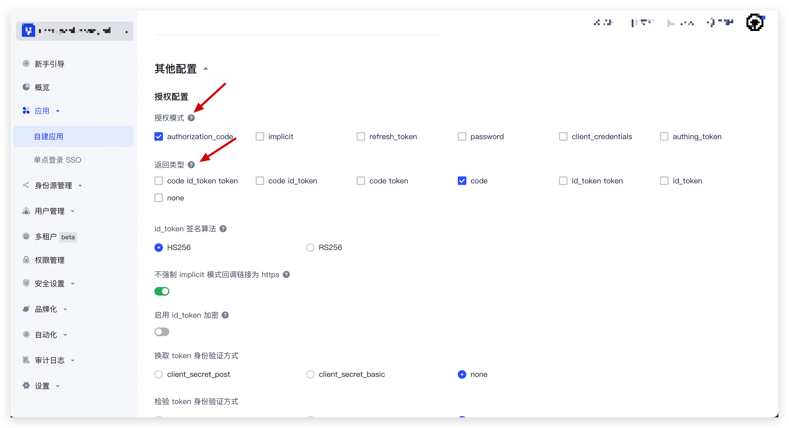
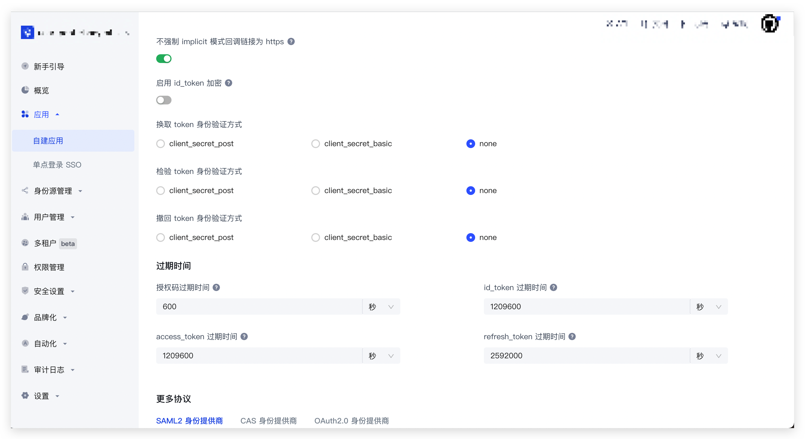

# 了解 Guard 模式

## 托管模式 & 内嵌模式

**托管模式：** 指跳转到 Authing 提供的托管登录页。Authing 默认使用 OIDC 标准协议认证，你的用户在登录时将始终由 Authing 提供的认证最佳实践保驾护航。

- 安全性：你的业务系统将用户重定向到 Authing，用户在此进行身份验证，然后重定向回在控制台配置的应用回调连接。
- 样式丰富性：托管模式提供了登录注册表单自定义配置，可通过控制台配置和 CSS 进行界面自定义。
- 集成便利性：你不需要额外运维登录页面，Authing 将负责此页面的维护和升级，当 Authing 有新功能发布之后，你不需要做任何操作即可获取最新能力。

**内嵌模式：** 指的是将 Authing 提供的登录组件（Guard）嵌入到你的 Web 应用中。仅需要几行 JavaScript 代码即可，该模式包含两种形态：

- 普通形态：样式与托管模式一致，但灵活之处在于你可以将它嵌入到你的任意的 DOM 节点。
- 模态框形态：和普通形态类似，只不过通过模态框（Modal）的样式进行展示。

**对于大多数登录认证场景，我们推荐使用「托管模式」进行集成。这是最简便、安全、通用的 Authing 认证最佳实践。**

## 使用托管模式

::: hint-info
使用托管模式会涉及到路由跳转，Safari、Firefox 等浏览器默认开启『阻止跨站跟踪』，导致 Cookie 无法有效传输，推荐使用 Chrome 浏览器。目前已有解决方案，我们接下来会修复这个问题。
:::

托管模式将跳转到 Authing 提供的托管登录页。由于此模式 Authing 默认使用 OIDC 标准协议认证，你需要进行以下额外配置：

- 在 [Authing 控制台](https://console.authing.cn) 的 <strong>应用 -> 自建应用 -> 应用详情</strong> 中配置 <strong>登录回调 URL</strong>，回调地址为下述示例代码中 Callback 页面地址，此处以 `http://localhost:3000/callback` 为例：



- 在应用详情的 <strong>协议配置 -> 授权配置</strong> 中，<strong>授权模式</strong> 选择      <strong>authentication_code</strong>，<strong>返回类型</strong> 选择 <strong>code</strong>:



- 如果是标准 Web 应用，请在应用详情的 <strong>协议配置 -> 授权配置</strong> 中，请确保应用的 <strong>换取 token 身份验证方式</strong> 设置为了 <strong>none</strong>。

::: hint-info
如果你的应用类型为单页 Web 应用，此次选项会被隐藏，为正常情况。
:::



### Guard 托管模式代码示例

:::: tabs :options="{ useUrlFragment: false }"

::: tab React

```tsx
// Jump.tsx

// React16 / 17
// 代码示例：https://github.com/Authing/Guard/blob/master/examples/guard-react/normal/src/pages/Jump.tsx
import { useGuard } from "@authing/guard-react";

// React 18
// 代码示例：https://github.com/Authing/Guard/blob/master/examples/guard-react18/normal/src/pages/Jump.tsx
// import { useGuard } from '@authing/guard-react18';

export default function Jump() {
  const guard = useGuard();

  // 跳转到 Authing 托管页面登录
  const startWithRedirect = () => guard.startWithRedirect();

  return (
    <div>
      <div>
        <button className="authing-button" onClick={startWithRedirect}>
          Start With Redirect
        </button>
      </div>
    </div>
  );
}
```

``` tsx
// Callback.tsx

// React 16 / 17
// 代码示例：https://github.com/Authing/Guard/blob/master/examples/guard-react/normal/src/pages/Callback.tsx
import { JwtTokenStatus, useGuard, User } from '@authing/guard-react';

// React 18
// 代码示例：https://github.com/Authing/Guard/blob/master/examples/guard-react18/normal/src/pages/Callback.tsx
// import { JwtTokenStatus, useGuard, User } from '@authing/guard-react18';

import React, { useEffect } from 'react';
import { useHistory } from 'react-router-dom';

export default function Callback() {
  const history = useHistory()
  const guard = useGuard()

  const handleCallback = async () => {
    try {
      // 1. 触发 guard.handleRedirectCallback() 方法完成登录认证
      // 用户认证成功之后，我们会将用户的身份凭证存到浏览器的本地缓存中
      await guard.handleRedirectCallback()

      // 2. 处理完 handleRedirectCallback 之后，你需要先检查用户登录态是否正常
      const loginStatus: JwtTokenStatus | undefined  = await guard.checkLoginStatus()

      if (!loginStatus) {
        return console.error('Guard is not get login status')
      }

      // 3. 获取到登录用户的用户信息
      const userInfo: User | null = await guard.trackSession()

      console.log(userInfo)

      // 你也可以重定向到你的任意业务页面，比如重定向到用户的个人中心
      // 如果你希望实现登录后跳转到同一页面的效果，可以通过在调用 startWithRedirect 时传入的自定义 state 实现
      // 之后你在这些页面可以通过 trackSession 方法获取用户登录态和用户信息

      // 示例一：跳转到固定页面
      history.replace('/personal')

      // 示例二：获取自定义 state，进行特定操作
      // const search = window.location.search
      // 从 URL search 中解析 state
    } catch (e) {
      // 登录失败，推荐再次跳转到登录页面
      console.error('Guard handleAuthingLoginCallback error: ', e)
    }
  }

  useEffect(() => {
    handleCallback()
  })

  return <div>This is Callback page</div>
}
```

``` tsx
// Personal.tsx

// React 16 / 17
// 代码示例：https://github.com/Authing/Guard/blob/master/examples/guard-react/normal/src/pages/Personal.tsx
import { useGuard, User } from '@authing/guard-react';

// React 18
// 代码示例：https://github.com/Authing/Guard/blob/master/examples/guard-react18/normal/src/pages/Personal.tsx
// import { useGuard, User } from '@authing/guard-react18';

import React, { useEffect, useState } from 'react';

export default function Personal() {
  const [userInfo, setUserInfo] = useState('')

  const guard = useGuard()

  useEffect(() => {
    guard.trackSession().then((res: User | null) => {
      setUserInfo(JSON.stringify(res, null, 2))
    })
  }, [])

  return (
    <div>
      {userInfo && (
        <div>
          <div>用户信息：</div>
          <textarea cols={100} rows={30} defaultValue={userInfo}></textarea>
        </div>
      )}
    </div>
  )
}
```
:::

::: tab Vue2

```javascript
// 代码示例：https://github.com/Authing/Guard/blob/master/examples/guard-vue2/normal/src/views/Jump.vue
// Jump.vue
export default {
  methods: {
    startWithRedirect() {
      // 跳转到 Authing 托管页面登录
      this.$guard.startWithRedirect();
    },
  },
};
```

``` javascript
// 代码示例：https://github.com/Authing/Guard/blob/master/examples/guard-vue2/normal/src/views/Callback.vue
// Callback.vue
export default {
  data () {
    return {
      message: 'This is callback page ~'
    }
  },
  mounted () {
    this.handleAuthingLoginCallback()
  },
  methods: {
    async handleAuthingLoginCallback () {
      try {
        // 1. 触发 guard.handleRedirectCallback() 方法完成登录认证
        // 用户认证成功之后，我们会将用户的身份凭证存到浏览器的本地缓存中
        await this.$guard.handleRedirectCallback()

        // 2. 处理完 handleRedirectCallback 之后，你需要先检查用户登录态是否正常
        const loginStatus = await this.$guard.checkLoginStatus()

        if (!loginStatus) {
          return console.error('Guard is not get login status')
        }

        // 3. 获取到登录用户的用户信息
        const userInfo = await this.$guard.trackSession()
        
        console.log(userInfo)

        // 你也可以重定向到你的任意业务页面，比如重定向到用户的个人中心
        // 如果你希望实现登录后跳转到同一页面的效果，可以通过在调用 startWithRedirect 时传入的自定义 state 实现
        // 之后你在这些页面可以通过 trackSession 方法获取用户登录态和用户信息
        // 示例一：跳转到固定页面
        this.$router.replace('/personal')
        // 示例二：获取自定义 state，进行特定操作
        // const search = window.location.search
        // 从 URL search 中解析 state
      } catch (e) {
        // 登录失败，推荐再次跳转到登录页面
        console.error('Guard handleAuthingLoginCallback error: ', e)
      }
    }
  }
}
```

``` html
<template>
  <div class="personal-container">
    <!-- 代码示例：https://github.com/Authing/Guard/blob/master/examples/guard-vue2/normal/src/views/Personal.vue -->
    <!-- Personal.vue -->
    <textarea id="" cols="100" rows="30" :value="userInfo"></textarea>
  </div>
</template>

<script>
export default {
  data () {
    return {
      userInfo: ''
    }
  },
  created () {
    this.getUserInfo()
  },
  methods: {
    async getUserInfo () {
      const userInfo = await this.$guard.trackSession()
      this.userInfo = JSON.stringify(userInfo, null, 2)
    }
  }
}
</script>
```

:::

::: tab Vue3

```javascript
// 代码示例：https://github.com/Authing/Guard/blob/master/examples/guard-vue3/normal/src/views/Jump.vue
// Jump.vue
import { useGuard } from "@authing/guard-vue3";

const guard = useGuard();

const startWithRedirect = () => {
  // 跳转到 Authing 托管页面登录
  guard.startWithRedirect();
};
```

``` html
<template>
  <div class="personal-container">
    <!-- 代码示例：https://github.com/Authing/Guard/blob/master/examples/guard-vue3/normal/src/views/Callback.vue -->
    <!-- Callback.vue -->
    <textarea id="" cols="100" rows="30" :value="userInfo"></textarea>
  </div>
</template>

<script lang="ts" setup>
import { onMounted } from 'vue'

import { useRouter } from 'vue-router'

import { useGuard } from '@authing/guard-vue3'

import type { JwtTokenStatus, User } from '@authing/guard-vue3'

const router = useRouter()

const guard = useGuard()

const handleAuthingLoginCallback = async () => {
  try {
    // 1. 触发 guard.handleRedirectCallback() 方法完成登录认证
    // 用户认证成功之后，我们会将用户的身份凭证存到浏览器的本地缓存中
    await guard.handleRedirectCallback()

    // 2. 处理完 handleRedirectCallback 之后，你需要先检查用户登录态是否正常
    const loginStatus: JwtTokenStatus | undefined = await guard.checkLoginStatus()

    if (!loginStatus) {
      return console.error('Guard is not get login status')
    }
    
    // 3. 获取到登录用户的用户信息
    const userInfo: User | null = await guard.trackSession()
    console.log(userInfo)

    // 你也可以重定向到你的任意业务页面，比如重定向到用户的个人中心
    // 如果你希望实现登录后跳转到同一页面的效果，可以通过在调用 startWithRedirect 时传入的自定义 state 实现
    // 之后你在这些页面可以通过 trackSession 方法获取用户登录态和用户信息
    // 示例一：跳转到固定页面
    router.replace({
      name: 'Personal'
    })

    // 示例二：获取自定义 state，进行特定操作
    // const search = window.location.search
    // 从 URL search 中解析 state
  } catch (e) {
    // 登录失败，推荐再次跳转到登录页面
    console.error('Guard handleAuthingLoginCallback error: ', e)
  }
}

onMounted(() => {
  handleAuthingLoginCallback()
})
</script>
```

``` html
<template>
  <div class="personal-container">
    <!-- 代码示例：https://github.com/Authing/Guard/blob/master/examples/guard-vue3/normal/src/views/Personal.vue -->
    <!-- Personal.vue -->
    <textarea id="" cols="100" rows="30" :value="userInfo"></textarea>
  </div>
</template>

<script lang="ts" setup>
import { ref, onMounted } from 'vue'

import { useGuard } from '@authing/guard-vue3'

import type { User } from '@authing/guard-vue3'

const userInfo = ref<string>('')

const guard = useGuard()

const getUserInfo = async () => {
  const _userInfo: User | null = await guard.trackSession()
  userInfo.value = JSON.stringify(_userInfo, null, 2)
}

onMounted(() => {
  getUserInfo()
})
</script>
```
:::

::: tab Angular

```typescript
// 代码示例：https://github.com/Authing/Guard/blob/master/examples/guard-angular/normal/src/app/pages/jump/jump.component.ts
// jump.component.ts
// Angular 组件中使用 Guard API
import { Component } from "@angular/core";
import { GuardService } from "@authing/guard-angular";

@Component({
  selector: "jump-container",
  templateUrl: "./jump.component.html",
  styleUrls: ["./jump.component.css"],
})
export class HomeComponent {
  constructor(
    // 使用 Angular 依赖注入，获取 Guard 实例
    private guard: GuardService
  ) {}

  startWithRedirect() {
    // 跳转到 Authing 托管页面登录
    this.guard.client.startWithRedirect();
  }
}
```

``` typescript
// 代码示例：https://github.com/Authing/Guard/blob/master/examples/guard-angular/normal/src/app/pages/callback/callback.component.ts
// callback.component.ts
import { Component } from '@angular/core'
import { Router } from '@angular/router'

import { GuardService, JwtTokenStatus, User } from '@authing/guard-angular'

@Component({
  selector: 'callback-container',
  templateUrl: './callback.component.html',
  styleUrls: ['./callback.component.css']
})
export class CallbackComponent {
  constructor (
    private router: Router,
    private guard: GuardService
  ) {}

  ngOnInit () {
    this.handleAuthingLoginCallback()
  }

  async handleAuthingLoginCallback () {
    try {
      // 1. 触发 guard.handleRedirectCallback() 方法完成登录认证
      // 用户认证成功之后，我们会将用户的身份凭证存到浏览器的本地缓存中
      await this.guard.client.handleRedirectCallback()

      // 2. 处理完 handleRedirectCallback 之后，你需要先检查用户登录态是否正常
      const loginStatus: JwtTokenStatus | undefined = await this.guard.client.checkLoginStatus()

      if (!loginStatus) {
        return console.error('Guard is not get login status')
      }

      // 3. 获取到登录用户的用户信息
      const userInfo: User | null = await this.guard.client.trackSession()

      console.log(userInfo)

      // 你也可以重定向到你的任意业务页面，比如重定向到用户的个人中心
      // 如果你希望实现登录后跳转到同一页面的效果，可以通过在调用 startWithRedirect 时传入的自定义 state 实现
      // 之后你在这些页面可以通过 trackSession 方法获取用户登录态和用户信息

      // 示例一：跳转到固定页面
      this.router.navigateByUrl('personal', {
        replaceUrl: true
      })

      // 示例二：获取自定义 state，进行特定操作
      // const search = window.location.search
      // 从 URL search 中解析 state
    } catch (e) {
      // 登录失败，推荐再次跳转到登录页面
      console.error('Guard handleAuthingLoginCallback error: ', e)
    }
  }
}
```

``` typescript
// 代码示例：https://github.com/Authing/Guard/blob/master/examples/guard-angular/normal/src/app/pages/personal/personal.component.ts
// personal.component.ts
import { Component } from '@angular/core'

import { GuardService, User } from '@authing/guard-angular'

@Component({
  selector: 'personal-container',
  templateUrl: './personal.component.html',
  styleUrls: ['./personal.component.css']
})
export class PersonalComponent {
  constructor(private guard: GuardService) {}

  userInfo = ''

  ngOnInit() {
    this.getUserInfo()
  }

  async getUserInfo() {
    const _userInfo: User | null = await this.guard.client.trackSession()
    this.userInfo = JSON.stringify(_userInfo || '', null, 2)
  }
}
```

:::

::: tab CDN

```javascript
// 代码示例：https://github.com/Authing/Guard/blob/master/examples/guard/normal/jump.html
// jump.html
const guard = new GuardFactory.Guard({
  // 你可以前往 Authing 控制台的本应用详情页查看你的 App ID
  appId: "AUTHING_APP_ID",

  // 如果你使用的是私有化部署的 Authing 服务，需要传入自定义 host，如:
  // host: 'https://my-authing-app.example.com',

  // 默认情况下，会使用你在 Authing 控制台中配置的第一个回调地址为此次认证使用的回调地址。
  // 如果你配置了多个回调地址，也可以手动指定（此地址也需要加入到应用的「登录回调 URL」中）：
  // redirectUri: "YOUR_REDIRECT_URI"
});

function startWithRedirect() {
  // 跳转到 Authing 托管页面登录
  guard.startWithRedirect();
}
```

``` javascript
// 代码示例：https://github.com/Authing/Guard/blob/master/examples/guard/normal/callback.html
// callback.html
const guard = new GuardFactory.Guard(guardOptions)

handleAuthingLoginCallback()

async function handleAuthingLoginCallback () {
  try {
    // 1. 触发 guard.handleRedirectCallback() 方法完成登录认证
    // 用户认证成功之后，我们会将用户的身份凭证存到浏览器的本地缓存中
    await guard.handleRedirectCallback()

    // 2. 处理完 handleRedirectCallback 之后，你需要先检查用户登录态是否正常
    const loginStatus = await guard.checkLoginStatus()

    if (!loginStatus) {
      return console.error('Guard is not get login status')
    }

    // 3. 获取到登录用户的用户信息
    const userInfo = await guard.trackSession()

    console.log(userInfo)

    // 你也可以重定向到你的任意业务页面，比如重定向到用户的个人中心
    // 如果你希望实现登录后跳转到同一页面的效果，可以通过在调用 startWithRedirect 时传入的自定义 state 实现
    // 之后你在这些页面可以通过 trackSession 方法获取用户登录态和用户信息

    // 示例一：跳转到固定页面
    window.location.replace(personalPageUrl)

    // 示例二：获取自定义 state，进行特定操作
    // const search = window.location.search
    // 从 URL search 中解析 state
  } catch (e) {
    // 登录失败，推荐再次跳转到登录页面
    console.error('Guard handleAuthingLoginCallback error: ', e)
  }
}
``` 

``` html
<!DOCTYPE html>
<html lang="en">
<head>
  <meta charset="UTF-8">
  <meta http-equiv="X-UA-Compatible" content="IE=edge">
  <meta name="viewport" content="width=device-width, initial-scale=1.0">
  <title>Authing Guard Demo - Personal</title>
  <script src="https://cdn.authing.co/packages/guard/latest/guard.min.js"></script>
  <script src="https://cdn.authing.co/packages/face-api/face-api.min.js"></script>
  <script src="./config.js"></script>
  <link rel="stylesheet" href="https://cdn.authing.co/packages/guard/latest/guard.min.css" />
</head>
<body>
  <!-- 代码示例：https://github.com/Authing/Guard/blob/master/examples/guard/normal/personal.html -->
  <!-- personal.html -->
  <button onclick="getUserInfo()">Get User Info</button>

  <script>
    const guard = new GuardFactory.Guard(guardOptions)

    async function getUserInfo () {
      const userInfo = await guard.trackSession()
      console.log(userInfo)
    }
  </script>
</body>
</html>
```
:::
::::

## 使用内嵌模式

### 普通形态

::: hint-info
点击 [在线体验](https://cdn.authing.co/packages/guard/ui/index.html)
:::

:::: tabs :options="{ useUrlFragment: false }"

::: tab React

```tsx
// React 16 / 17
// 代码示例：https://github.com/Authing/Guard/blob/master/examples/guard-react/normal/src/pages/Embed.tsx
import { useGuard, User } from "@authing/guard-react";

// React 18
// 代码示例：https://github.com/Authing/Guard/blob/master/examples/guard-react18/normal/src/pages/Embed.tsx
// import { useGuard, User } from "@authing/guard-react18";

import React, { useEffect } from "react";

export default function Login() {
  // 获取 Guard 实例
  const guard = useGuard();

  useEffect(() => {
    // 使用 start 方法挂载 Guard 组件到你指定的 DOM 节点，登录成功后返回 userInfo
    guard.start("#authing-guard-container").then((userInfo: User) => {
      console.log("userInfo: ", userInfo);
    });
  }, []);

  return (
    <div>
      <div id="authing-guard-container"></div>
    </div>
  );
}
```

:::

::: tab Vue2

```vue
<template>
  <!-- 代码示例：https://github.com/Authing/Guard/blob/master/examples/guard-vue2/normal/src/views/Embed.vue -->
  <div id="authing-guard-container"></div>
</template>
<script>
export default {
  mounted() {
    // 使用 start 方法挂载 Guard 组件到你指定的 DOM 节点，登录成功后返回 userInfo
    this.$guard.start("#authing-guard-container").then((userInfo) => {
      console.log("userInfo: ", userInfo);
    });
  },
};
</script>
```

:::

::: tab Vue3

```vue
<template>
  <!-- 代码示例：https://github.com/Authing/Guard/blob/master/examples/guard-vue3/normal/src/views/Embed.vue -->
  <div id="authing-guard-container"></div>
</template>

<script lang="ts" setup>
import { onMounted } from "vue";
import { useGuard } from "@authing/guard-vue3";
import type { User } from "@authing/guard-vue3";

const guard = useGuard();

onMounted(() => {
  // 使用 start 方法挂载 Guard 组件到你指定的 DOM 节点，登录成功后返回 userInfo
  guard.start("#authing-guard-container").then((userInfo: User) => {
    console.log("userInfo: ", userInfo);
  });
});
</script>
```

:::

::: tab Angular

```typescript
// 代码示例：https://github.com/Authing/Guard/blob/master/examples/guard-angular/normal/src/app/pages/embed/embed.component.ts
import { Component } from "@angular/core";
import { GuardService, User } from "@authing/guard-angular";

@Component({
  selector: "embed-container",
  templateUrl: "./embed.component.html",
  styleUrls: ["./embed.component.css"]
})
export class LoginComponent {
  constructor(private guard: GuardService) {}

  ngOnInit() {
    // 使用 start 方法挂载 Guard 组件到你指定的 DOM 节点，登录成功后返回 userInfo
    this.guard.client
      .start("#authing-guard-container")
      .then((userInfo: User) => {
        console.log("userInfo: ", userInfo);
      });
  }
}
```

:::

::: tab CDN

```html
<!-- https://github.com/Authing/Guard/tree/dev-v6/examples/guard/normal/embed.html -->
<div id="authing-guard-container"></div>
```

```javascript
// 获取 Guard 实例
const guard = new GuardFactory.Guard({
  // 你可以前往 Authing 控制台的本应用详情页查看你的 App ID
  appId: "AUTHING_APP_ID",

  // 如果你使用的是私有化部署的 Authing 服务，需要传入自定义 host，如:
  // host: 'https://my-authing-app.example.com',

  // 默认情况下，会使用你在 Authing 控制台中配置的第一个回调地址为此次认证使用的回调地址。
  // 如果你配置了多个回调地址，也可以手动指定（此地址也需要加入到应用的「登录回调 URL」中）：
  // redirectUri: "YOUR_REDIRECT_URI"
});

// 使用 start 方法挂载 Guard 组件到你指定的 DOM 节点，登录成功后返回 userInfo
guard.start("#authing-guard-container").then((userInfo) => {
  console.log("userInfo: ", userInfo);
});
```

:::

::::

### 模态框形态

::: hint-info
点击 [在线体验](https://cdn.authing.co/packages/guard/ui/index.html?mode=modal)
:::

初始化时，你需要将初始化参数的 `mode` 设置成 `modal`。

你可以通过 `guard` 实例 `start` 方法对『模态框』进行渲染，同时可以通过 `show` 和 `hide` 控制『模态框』的显示和隐藏：

:::: tabs :options="{ useUrlFragment: false }"

::: tab React

```tsx
// App.tsx

// React 16 / 17
// 代码示例：https://github.com/Authing/Guard/blob/master/examples/guard-react/modal/src/App.tsx
import { GuardProvider } from "@authing/guard-react";
import "@authing/guard-react/dist/esm/guard.min.css";

// React 18
// 代码示例：https://github.com/Authing/Guard/blob/master/examples/guard-react18/modal/src/App.tsx
// import { GuardProvider } from "@authing/guard-react18";
// import "@authing/guard-react18/dist/esm/guard.min.css";

import React from "react";
import RouterComponent from "./router";

function App() {
  return (
    <GuardProvider
      appId="AUTHING_APP_ID"
      mode="modal"
      // 如果你使用的是私有化部署的 Authing 服务，需要传入自定义 host，如:
      // host="https://my-authing-app.example.com"

      // 默认情况下，会使用你在 Authing 控制台中配置的第一个回调地址为此次认证使用的回调地址。
      // 如果你配置了多个回调地址，也可以手动指定（此地址也需要加入到应用的「登录回调 URL」中）：
      // redirectUri="YOUR_REDIRECT_URI"
    >
      <RouterComponent></RouterComponent>
    </GuardProvider>
  );
}
```

```tsx
// Embed.tsx

// React 16 / 17
// 代码示例：https://github.com/Authing/Guard/blob/master/examples/guard-react/modal/src/pages/Embed.tsx
import { useGuard, User } from "@authing/guard-react";

// React 18
// 代码示例：https://github.com/Authing/Guard/blob/master/examples/guard-react18/modal/src/pages/Embed.tsx
// import { useGuard, User } from "@authing/guard-react18";

export default function Embed() {
  const guard = useGuard();

  const showGuard = () => guard.show();

  useEffect(() => {
    // 挂载模态框，当用户完成登录之后，你可以获取到用户信息
    guard.start("#authing-guard-container").then((userInfo: User) => {
      console.log("userInfo: ", userInfo);

      setTimeout(() => {
        guard.hide();
      }, 2000);
    });
  }, []);

  return (
    <div>
      <button className="authing-button" onClick={showGuard}>
        Show Guard
      </button>

      <div>
        模态窗口打开并登录成功后会在 2 秒内调用 hide 方法关闭模态窗口，用于展示 hide 方法的效果
      </div>
      <div>模态框自动关闭后，可以点击 Show Guard 按钮再次显示</div>

      <div id="authing-guard-container"></div>
    </div>
  );
}
```

:::

::: tab Vue2

```javascript
// 代码示例：https://github.com/Authing/Guard/blob/master/examples/guard-vue2/modal/src/main.js
// main.js
import Vue from "vue";
import { GuardPlugin } from "@authing/guard-vue2";
import "@authing/guard-vue2/dist/esm/guard.min.css";

Vue.use(GuardPlugin, {
  appId: "AUTHING_APP_ID",
  mode: "modal",
  // 如果你使用的是私有化部署的 Authing 服务，需要传入自定义 host，如:
  // host: 'https://my-authing-app.example.com',

  // 默认情况下，会使用你在 Authing 控制台中配置的第一个回调地址为此次认证使用的回调地址。
  // 如果你配置了多个回调地址，也可以手动指定（此地址也需要加入到应用的「登录回调 URL」中）：
  // redirectUri: "YOUR_REDIRECT_URI"
});
```

```html
<template>
  <!-- 代码示例：https://github.com/Authing/Guard/blob/master/examples/guard-vue2/modal/src/views/Embed.vue -->
  <!-- Embed.vue -->
  <div class="embed-container">
    <button class="authing-button" @click="showGuard">Show Guard</button>

    <div>
      模态窗口打开并登录成功后会在 2 秒内调用 hide 方法关闭模态窗口，用于展示 hide 方法的效果
    </div>
    <div>模态框自动关闭后，可以点击 Show Guard 按钮再次显示</div>

    <div id="authing-guard-container"></div>
  </div>
</template>

<script>
  export default {
    mounted() {
      // 使用 start 方法挂载 Guard 组件到你指定的 DOM 节点，登录成功后返回 userInfo
      this.$guard.start("#authing-guard-container").then((userInfo) => {
        console.log("userInfo: ", userInfo);

        setTimeout(() => {
          this.$guard.hide();
        }, 2000);
      });
    },
    methods: {
      showGuard() {
        this.$guard.show();
      },
    },
  };
</script>
```

:::

::: tab Vue3

```javascript
// 代码示例：https://github.com/Authing/Guard/blob/master/examples/guard-vue3/modal/src/main.ts
// main.ts
import { createApp } from "vue";
import App from "./App.vue";
import { createGuard } from "@authing/guard-vue3";
import "@authing/guard-vue3/dist/esm/guard.min.css";

const app = createApp(App);

app.use(
  createGuard({
    appId: "AUTHING_APP_ID",
    mode: "modal",
    // 如果你使用的是私有化部署的 Authing 服务，需要传入自定义 host，如:
    // host: 'https://my-authing-app.example.com',

    // 默认情况下，会使用你在 Authing 控制台中配置的第一个回调地址为此次认证使用的回调地址。
    // 如果你配置了多个回调地址，也可以手动指定（此地址也需要加入到应用的「登录回调 URL」中）：
    // redirectUri: "YOUR_REDIRECT_URI"
  })
);
```

```html
<template>
  <!-- 代码示例：https://github.com/Authing/Guard/blob/master/examples/guard-vue3/modal/src/views/Embed.vue -->
  <!-- Embed.vue -->
  <div class="embed-container">
    <button class="authing-button" @click="showGuard">Show Guard</button>

    <div>
      模态窗口打开并登录成功后会在 2 秒内调用 hide 方法关闭模态窗口，用于展示 hide 方法的效果
    </div>
    <div>模态框自动关闭后，可以点击 Show Guard 按钮再次显示</div>

    <div id="authing-guard-container"></div>
  </div>
</template>

<script lang="ts" setup>
  import { onMounted } from "vue";

  import { useGuard } from "@authing/guard-vue3";

  const guard = useGuard();

  const showGuard = () => guard.show();

  onMounted(() => {
    // 使用 start 方法挂载 Guard 组件到你指定的 DOM 节点，登录成功后返回 userInfo
    guard.start("#authing-guard-container").then((userInfo) => {
      console.log("userInfo: ", userInfo);

      setTimeout(() => {
        guard.hide();
      }, 2000);
    });
  });
</script>
```

:::

::: tab Angular

```typescript
// 代码示例：https://github.com/Authing/Guard/blob/master/examples/guard-angular/modal/src/app/app.module.ts
// app.module.ts
import { NgModule } from "@angular/core";
import { BrowserModule } from "@angular/platform-browser";
import { AppRoutingModule } from "./app-routing.module";
import { AppComponent } from "./app.component";
import { GuardModule } from "@authing/guard-angular";
@NgModule({
  declarations: [AppComponent],
  imports: [
    BrowserModule,
    AppRoutingModule,
    GuardModule.forRoot({
      appId: "AUTHING_APP_ID",
      mode: "modal",
      // 如果你使用的是私有化部署的 Authing 服务，需要传入自定义 host，如:
      // host: 'https://my-authing-app.example.com',

      // 默认情况下，会使用你在 Authing 控制台中配置的第一个回调地址为此次认证使用的回调地址。
      // 如果你配置了多个回调地址，也可以手动指定（此地址也需要加入到应用的「登录回调 URL」中）：
      // redirectUri: "YOUR_REDIRECT_URI"
    }),
  ],
  providers: [],
  bootstrap: [AppComponent],
})
export class AppModule {}
```

```typescript
// 代码示例：https://github.com/Authing/Guard/blob/master/examples/guard-angular/modal/src/app/pages/embed/embed.component.ts
// embed.component.ts
import { Component } from "@angular/core";

import { GuardService, User } from "@authing/guard-angular";

@Component({
  selector: "embed-container",
  templateUrl: "./embed.component.html",
  styleUrls: ["./embed.component.css"],
})
export class EmbedComponent {
  constructor(private guard: GuardService) {}

  ngOnInit() {
    this.guard.client
      .start("#authing-guard-container")
      .then((userInfo: User) => {
        console.log("userInfo: ", userInfo);

        setTimeout(() => {
          this.guard.client.hide();
        }, 2000);
      });
  }

  showGuard() {
    this.guard.client.show();
  }
}
```

:::

::: tab CDN

```html
<!-- 代码示例：https://github.com/Authing/Guard/blob/master/examples/guard/modal/embed.html -->
<button onclick="showGuard()">Show Guard</button>

<div>
  模态窗口打开并登录成功后会在 2 秒内调用 hide 方法关闭模态窗口，用于展示 hide
  方法的效果
</div>
<div>模态框自动关闭后，可以点击 Show Guard 按钮再次显示</div>

<div id="authing-guard-container"></div>
```

```javascript
const guard = new GuardFactory.Guard({
  appId: "AUTHING_APP_ID",
  mode: "modal",
  // 如果你使用的是私有化部署的 Authing 服务，需要传入自定义 host，如:
  // host: 'https://my-authing-app.example.com',

  // 默认情况下，会使用你在 Authing 控制台中配置的第一个回调地址为此次认证使用的回调地址。
  // 如果你配置了多个回调地址，也可以手动指定（此地址也需要加入到应用的「登录回调 URL」中）：
  // redirectUri: "YOUR_REDIRECT_URI"
});

guard.start("#authing-guard-container").then((userInfo) => {
  // 登录成功后将在 then 回调中获取到 userInfo
  console.log("userInfo: ", userInfo);

  setTimeout(() => {
    guard.hide();
  }, 2000);
});

function showGuard() {
  guard.show();
}
```

:::

::::
