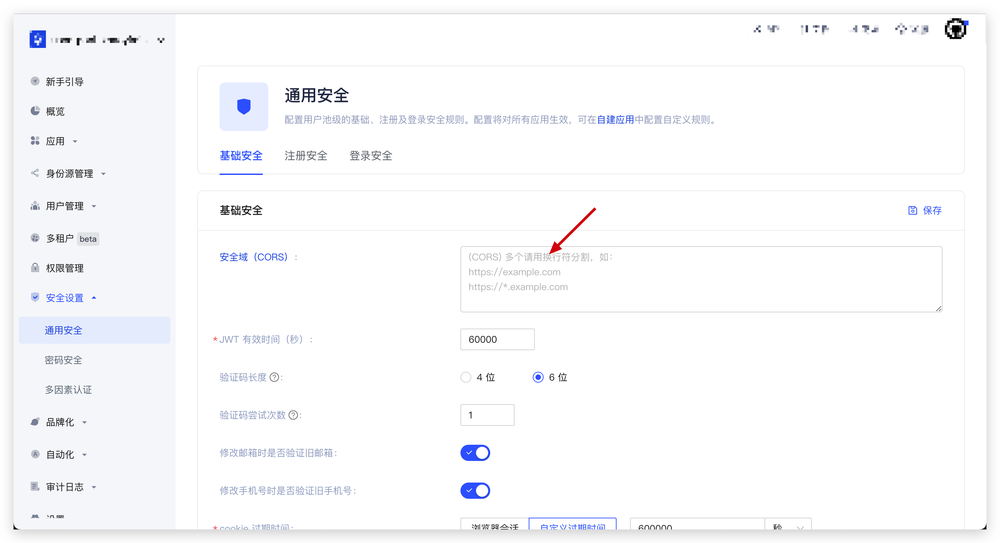

# 配置安全域

默认情况下，Authing 不会校验 API 请求来源，你可以在 Authing 控制台中的 <strong>安全设置 -> 通用安全 -> 基础安全 -> 安全域（CORS）</strong>进行配置。

::: hint-info
如果有多个域名，可以通过换行符（\n）进行分割。
:::

配置之后，只有在你安全域配置白名单中的域，才能调用相关 API，从而正常使用 Authing Guard 功能。

::: hint-info
你可能感兴趣：[配置 Web 安全域](https://docs.authing.cn/v2/guides/security/config-domain.html)
:::